# 🚀 GitHub + ClawCloud 部署指南

## 📋 部署概述

使用 Git 方式将党员统计系统部署到 ClawCloud 服务器，实现代码版本管理和自动化部署。

## 🔧 部署步骤

### 第一步：推送代码到 GitHub

```bash
# 1. 初始化 Git 仓库（如果还没有）
git init

# 2. 添加远程仓库
git remote add origin https://github.com/sheldore/partysta.git

# 3. 配置服务器信息
cp server-config.example.sh server-config.sh
nano server-config.sh  # 修改为你的实际配置

# 4. 提交并推送代码
git add .
git commit -m "Initial commit: Party member management system"
git push -u origin main
```

### 第二步：在服务器上首次部署

```bash
# 1. 连接到 ClawCloud 服务器
ssh root@deapps.huihys.ip-ddns.com

# 2. 克隆仓库
git clone https://github.com/sheldore/partysta.git /root/apps/party-system

# 3. 进入项目目录
cd /root/apps/party-system

# 4. 执行服务器端部署
chmod +x deploy/server-git-deploy.sh
./deploy/server-git-deploy.sh
```

### 第三步：后续更新部署

**本地开发完成后：**

```bash
# 1. 在本地项目目录执行
chmod +x deploy/git-deploy.sh
./deploy/git-deploy.sh

# 这个脚本会自动：
# - 提交本地更改
# - 推送到 GitHub
# - 在服务器上拉取最新代码
# - 重新部署应用
```

## 🔧 配置说明

### server-config.sh 配置文件

```bash
# 服务器信息
export SERVER_HOST="deapps.huihys.ip-ddns.com"
export SERVER_USER="root"
export SERVER_PORT="22"
export SERVER_PATH="/root/apps/party-system"

# Git 仓库信息
export GIT_REPO="https://github.com/sheldore/partysta.git"
export GIT_BRANCH="main"

# 应用配置
export PARTY_ADMIN_PASSWORD="your-secure-password"  # 请修改
export BASE_PATH="/partysta"
```

## 🌐 访问地址

部署完成后的访问地址：

- **主应用**: https://deapps.huihys.ip-ddns.com/partysta
- **健康检查**: https://deapps.huihys.ip-ddns.com/partysta/api/health
- **文件管理**: https://deapps.huihys.ip-ddns.com:5000 (club/123456)
- **WebSSH**: https://deapps.huihys.ip-ddns.com:8888 (club/123456)

## 🔄 工作流程

### 开发流程

1. **本地开发** → 修改代码
2. **测试验证** → 确保功能正常
3. **Git 部署** → 运行 `./deploy/git-deploy.sh`
4. **验证部署** → 访问线上地址确认更新

### 部署流程

```mermaid
graph LR
    A[本地开发] --> B[Git 提交]
    B --> C[推送到 GitHub]
    C --> D[服务器拉取代码]
    D --> E[自动部署]
    E --> F[服务重启]
    F --> G[部署完成]
```



## 🛠️ 管理命令

### 服务管理

```bash
# 在服务器上执行
cd /root/apps/party-system

# 查看服务状态
./service.sh status

# 重启服务
./service.sh restart

# 查看日志
./service.sh logs

# 停止服务
./service.sh stop

# 启动服务
./service.sh start
```

### 手动更新

```bash
# 如果自动部署失败，可以手动更新
ssh root@deapps.huihys.ip-ddns.com
cd /root/apps/party-system

# 拉取最新代码
git pull origin main

# 重新部署
./manual-deploy.sh
```

## 🔒 安全配置

### 1. 修改默认密码

```bash
# 编辑配置文件
nano server-config.sh

# 修改管理员密码
export PARTY_ADMIN_PASSWORD="your-secure-password"

# 重新部署
./deploy/git-deploy.sh
```

### 2. 配置 SSL 证书

```bash
# 在服务器上执行
ssh root@deapps.huihys.ip-ddns.com
cd /root/apps/party-system

# 配置 SSL
./scripts/linux/quick-ssl-setup.sh
```

## 📊 监控和维护

### 日志监控

```bash
# 实时查看应用日志
./service.sh logs

# 查看 Nginx 日志
tail -f /var/log/nginx/access.log
tail -f /var/log/nginx/error.log
```

### 数据备份

```bash
# 手动备份数据
tar -czf backup-$(date +%Y%m%d).tar.gz data/

# 设置自动备份
echo "0 2 * * * cd /root/apps/party-system && tar -czf /root/backups/party-data-\$(date +\%Y\%m\%d).tar.gz data/" | crontab -
```

## 🐛 故障排除

### 常见问题

1. **Git 推送失败**
   ```bash
   # 检查远程仓库配置
   git remote -v
   
   # 重新设置远程仓库
   git remote set-url origin https://github.com/sheldore/partysta.git
   ```

2. **服务器连接失败**
   ```bash
   # 测试 SSH 连接
   ssh -p 22 root@deapps.huihys.ip-ddns.com
   
   # 检查配置文件
   cat server-config.sh
   ```

3. **应用启动失败**
   ```bash
   # 查看详细日志
   ./service.sh logs
   
   # 手动启动调试
   node backend-server.js
   ```

## 💡 最佳实践

1. **定期备份数据**
2. **使用分支管理功能开发**
3. **部署前在本地测试**
4. **监控应用日志**
5. **定期更新依赖包**

---

**🎉 现在你可以通过 Git 方式轻松管理和部署党员统计系统了！**